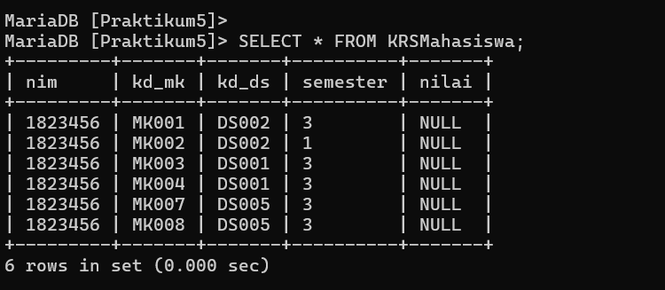

## Profil
| Variable | Isi |
| -------- | --- |
| **Nama** | ALVIN ALFANDY |
| **NIM** | 312310473 |
| **Kelas** | TI.23.A5 |
| **Mata Kuliah** | Basis data |

# Soal Latihan Praktikum 


# Tabel mahasiswa


# Tabel dosen


# Tabel matakuliah


# Tabel jadwal mengajar


# Tabel Krsmahasiwa


## Latihan

- Lakukan join table Mahasiswa dan Dosen.
- Lakukan join tabel Matakuliah dan Dosen.
- Lakukan join table JadwalMengajar, Dosen, dan Matakuliah.
- Lakukan join tabel KrsMahasiswa, Mahasiswa, Matakuliah, dan Dosen.

## Buat Script SQL JOIN Table berdasarkan skema data diatas.

- Lakukan join table Mahasiswa dan Dosen.

```
SELECT m.nim, m.nama, m.jk, d.nama AS 'Dosen PA'
FROM mahasiswa m
JOIN dosen d ON m.kd_ds = d.kd_ds;
```
- LEFT JOIN table Mahasiswa dan Dosen

```
SELECT Mahasiswa.nim, Mahasiswa.nama, Mahasiswa.jk, Dosen.nama AS "Dosen PA"
FROM Mahasiswa LEFT JOIN Dosen ON Dosen.kd_ds = Mahasiswa.kd_ds;
```

- Lakukan join tabel Matakuliah dan Dosen

```
SELECT Matakuliah.kd_mk, Matakuliah.nama AS "Nama Matakuliah", Matakuliah.sks, Dosen.nama AS "Nama Dosen Pengampu"
FROM JadwalMengajar
LEFT JOIN Matakuliah ON JadwalMengajar.kd_mk = Matakuliah.kd_mk
LEFT JOIN Dosen ON JadwalMengajar.kd_ds = Dosen.kd_ds;

```
- Lakukan join table JadwalMengajar, Dosen, dan Matakuliah

```
SELECT jm.kd_mk, mk.nama, mk.sks, d.nama AS 'Dosen Pengampu'
FROM jadwalmengajar jm
JOIN dosen d ON jm.kd_ds = d.kd_ds
JOIN matakuliah mk ON jm.kd_mk = mk.kd_mk;
```
-  join tabel KrsMahasiswa, Mahasiswa, Matakuliah, dan Dosen

```
SELECT km.kd_mk, mk.nama, mk.sks, d.nama AS 'Dosen Pengampu', jm.hari, jm.jam, jm.ruang
FROM krsmahasiswa km
JOIN mahasiswa m ON km.nim = m.nim
JOIN matakuliah mk ON km.kd_mk = mk.kd_mk
JOIN jadwalmengajar jm ON km.kd_mk = jm.kd_mk AND km.kd_ds = jm.kd_ds
JOIN dosen d ON jm.kd_ds = d.kd_ds;
```

### Buat laporan praktikum yang berisi, langkah-langkah praktikum beserta screenshot yang sudah dilakukan dalam bentuk dokumen.

## SELESAI  


